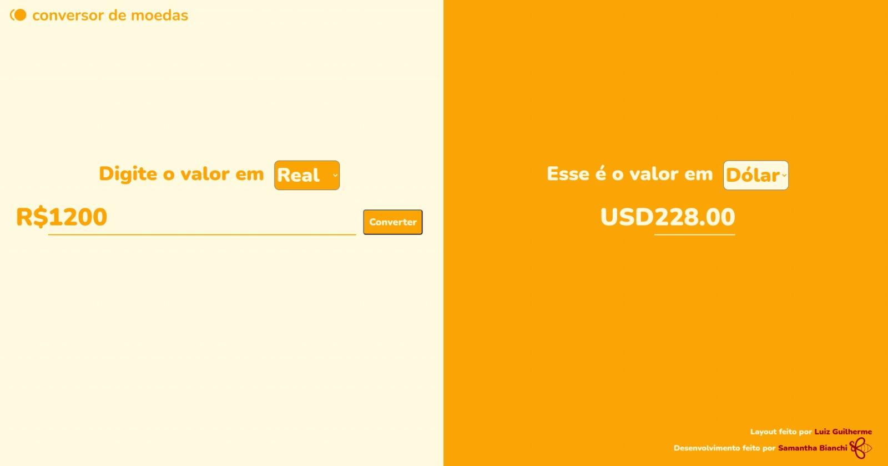

# Conversor de Moedas

    

 

# 💻 Projeto

Esse projeto é um conversor de moedas convencional onde o usuário pode fazer conversões entre Real, Dólar e Euro. Os valores são predefinidos com base na cotação realizada no dia 06/02/2023 e não consomem nenhuma API.

 

## 🛠️ Desenvolvido com

* [Figma](https://www.figma.com/) - Design UX-UI.
* [JavaScript](https://developer.mozilla.org/pt-BR/docs/Web/JavaScript) - Linguagem utilizada no Front-end.
* [HTML](https://developer.mozilla.org/pt-BR/docs/Web/HTML) - Linguagem de marcação utilizada no Front-end.
* [CSS](https://developer.mozilla.org/pt-BR/docs/Web/CSS) - Utilizado para estilização das páginas no Front-end.
 

## 💡 Layout

O Layout foi desenvolvido pelo **[Luiz Guilherme](https://www.linkedin.com/in/luiz-guilherme-474b85145/)** e você pode visualizar através **[desse link](https://www.figma.com/community/file/1185353279405975349)**. Para acessá-lo é necessário ter uma conta no **[Figma](https://www.figma.com/)**